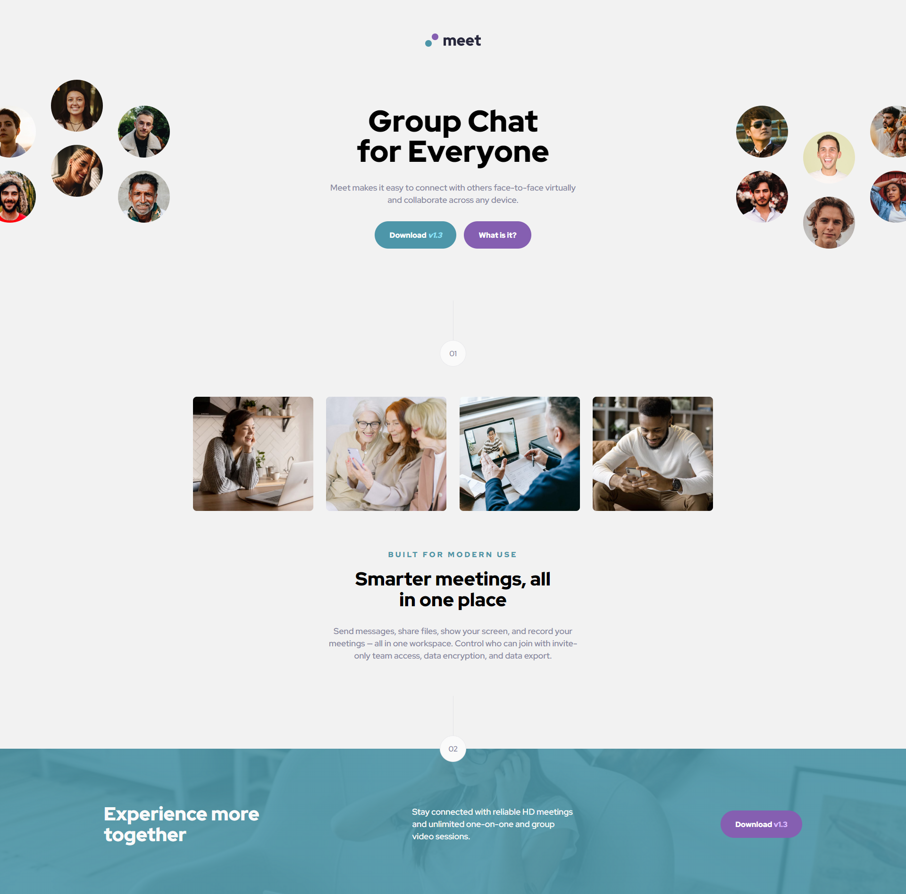

meet-landing-page


## The challenge

- Develop a page trying to make it as close as possible to the image made by the designer


## Links

- Solution URL: [Add solution URL here](https://your-solution-url.com)
- Live Site URL: [https://meet-landing-page-bice.vercel.app/](https://meet-landing-page-bice.vercel.app/)


## Built with

- SASS 
- HTML 

## What I learned

I learned how to use @mixin smarter to avoid rewriting techos of code. Also I changed my function to create flexible measures, instead of using that crazy function now I use this:

```
@mixin heightFlex( $minHeight, $mediumHeight, $maxHeight, $mobileWidth: 375, $tableWidth: 768) {

     max-height: $maxHeight * 1px;
     min-height: $minHeight * 1px;
     height: floor($mediumHeight / $tableWidth * 100 * 1vw) ;
    
     @media (max-width: $tableWidth * 1px) {
         max-height: $mediumHeight * 1px;
         height: floor($minHeight / $mobileWidth * 100 * 1vw);
     }
}

```
Figured out how to use CSS @keys to make some basic but cool animations

## **Resources**

- [⭐ Minicurso Animações CSS](https://www.youtube.com/watch?v=eTELLTacg-8&t=809s)

## **Author**

- Frontend Mentor - [@MarlonPassos-git](https://www.frontendmentor.io/profile/MarlonPassos-git)

